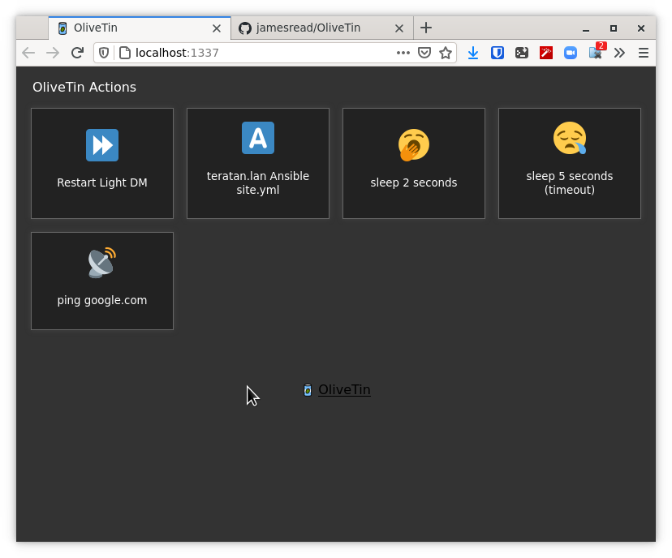
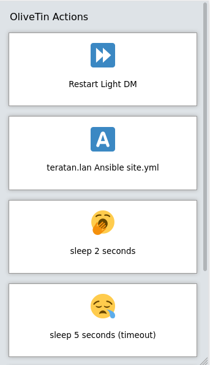

# OliveTin


OliveTin is a web interface for running Linux shell commands.

Some example **use cases**;

1. Give controlled access to run shell commands to less technical folks who cannot be trushed with SSH. I use this so my family can `podman restart plex` without asking me, and without giving them shell access!
2. Great for home automation tablets stuck on walls around your house - I use this to turn Hue lights on and off for example. 
3. Sometimes SSH access isn't possible to a server, or you are feeling too lazy to type a long command you run regulary! I use this to send Wake on Lan commands to servers around my house.

## YouTube video demo (6 mins)

[](https://www.youtube.com/watch?v=Ej6NM9rmZtk)

## Features

* **Responsive, touch-friendly UI** - great for tablets and mobile
* **Super simple config in YAML** - because if it's not YAML now-a-days, it's not "cloud native" :-) 
* **Dark mode** - for those of you that roll that way.
* **Accessible** - passes all the accessibility checks in Firefox, and issues with accessibility are taken seriously.  
* **Container** - available for quickly testing and getting it up and running, great for the selfhosted community. 
* **Integrate with anything** - OliveTin just runs Linux shell commands, so theoretially you could integrate with a bunch of stuff just by using curl, ping, etc. However, writing your own shell scripts is a great way to extend OliveTin.
* **Lightweight on resources** - uses only a few MB of RAM and barely any CPU. Written in Go, with a web interface written as a modern, responsive, Single Page App that uses the REST/gRPC API.
* **Good amount of unit tests and style checks** - helps potential contributors be consistent, and helps with maintainability.

## Screenshots

Desktop web browser;


Desktop web browser (dark mode); 



Mobile screen size (responsive layout); 



## Example `config.yaml` 

Put this `config.yaml` in `/etc/OliveTin/` if you're running a standard service, or mount it at `/config` if running in a container.

```yaml
listenAddressWebUI: 0.0.0.0:1337 # Listen on all addresses available, port 1337
logLevel: "INFO"
actions: 
- title: Restart Plex
  icon: smile
  shell: docker restart plex
  
  # This will send 1 ping 
- title: Ping Google.com
  shell: ping google.com -c 1
  
  # Restart lightdm on host "overseer"
- title: restart lightdm
  icon: poop
  shell: ssh root@overseer 'service lightdm restart'
```

A full example config can be found at in this repository - [config.yaml](https://github.com/jamesread/OliveTin/blob/main/var/config.yaml).

## Ports 

By default OliveTin will use the following ports;

* `1337` - for hosting the web interface
* `1338` - for the REST API (the api the web interface uses to do stuff)
* `1339` - a modern gRPC API (OliveTin uses protobuf under the hood) 

Some people might not want the gRPC API public - simply set `listenAddressGrpcActions: 127.0.0.1:1339` in your config so it doesn't listen publicly. It cannot be disabled completely - it's required for the REST API to work.

## Installation - systemd service (recommended)

Running OliveTin as a systemd service on a Linux machine is a bit more effort than running as a container - but it means it can use any program installed on your machine (you don't have to add programs to a container). 

1. Copy the `OliveTin` binary to `/usr/sbin/OliveTin`
2. Copy the `webui` directory contents to `/var/www/olivetin/` (eg, `/var/www/olivetin/index.html`)
3. Copy the `OliveTin.service` file to `/etc/systemd/system/`
4. Create a `config.yaml` using the example provided above to get you started.

Run `systemctl restart OliveTin` and check `systemctl status OliveTin`.

## Installation - as a container 

Of course, running a container image is very straightforward - but you might need to add files and programs to the OliveTin container to make it useful for your use case. Generally running a systemd service is better for OliveTin. 

### Running - `podman` (or `docker`)

There is a container image that is periodically updated here; https://hub.docker.com/repository/docker/jamesread/olivetin 

```
root@host: podman create --name olivetin -p 1337 -p 1338 -p 1339 -v /etc/olivetin/:/config:ro docker.io/jamesread/olivetin

```

### Building - `buildah` (or `docker build`)

```
root@host: buildah bud -t olivetin
```

