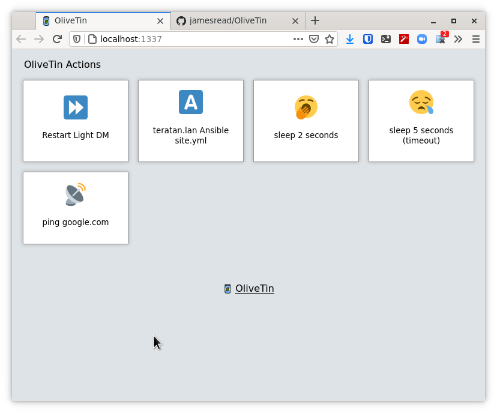

# OliveTin


OliveTin is a web interface for running Linux shell commands.

[](https://discord.gg/jhYWWpNJ3v)
[](https://goreportcard.com/report/github.com/OliveTin/OliveTin)


Some example **use cases**;

1. Give controlled access to run shell commands to less technical folks who cannot be trusted with SSH. I use this so my family can `podman restart plex` without asking me, and without giving them shell access!
2. Great for home automation tablets stuck on walls around your house - I use this to turn Hue lights on and off for example. 
3. Sometimes SSH access isn't possible to a server, or you are feeling too lazy to type a long command you run regularly! I use this to send Wake on Lan commands to servers around my house.

[Join the community on Discord.](https://discord.gg/jhYWWpNJ3v)

## YouTube video demo (6 mins)

[](https://www.youtube.com/watch?v=Ej6NM9rmZtk)

## Features

* **Responsive, touch-friendly UI** - great for tablets and mobile
* **Super simple config in YAML** - because if it's not YAML now-a-days, it's not "cloud native" :-) 
* **Dark mode** - for those of you that roll that way.
* **Accessible** - passes all the accessibility checks in Firefox, and issues with accessibility are taken seriously.  
* **Container** - available for quickly testing and getting it up and running, great for the selfhosted community. 
* **Integrate with anything** - OliveTin just runs Linux shell commands, so theoretially you could integrate with a bunch of stuff just by using curl, ping, etc. However, writing your own shell scripts is a great way to extend OliveTin.
* **Lightweight on resources** - uses only a few MB of RAM and barely any CPU. Written in Go, with a web interface written as a modern, responsive, Single Page App that uses the REST/gRPC API.
* **Good amount of unit tests and style checks** - helps potential contributors be consistent, and helps with maintainability.

## Screenshots

Desktop web browser;



Desktop web browser (dark mode); 


Mobile screen size (responsive layout); 


## Documentation

All documentation can be found at http://docs.olivetin.app . This includes installation and usage guide, etc. 

## Example `config.yaml` 

Put this `config.yaml` in `/etc/OliveTin/` if you're running a standard service, or mount it at `/config` if running in a container.

```yaml
listenAddressWebUI: 0.0.0.0:1337 # Listen on all addresses available, port 1337
logLevel: "INFO"
actions: 
- title: Restart Plex
  icon: smile
  shell: docker restart plex
  
  # This will send 1 ping 
- title: Ping Google.com
  shell: ping google.com -c 1
  
  # Restart lightdm on host "overseer"
- title: restart lightdm
  icon: poop
  shell: ssh root@overseer 'service lightdm restart'
```

A full example config can be found at in this repository - [config.yaml](https://github.com/OliveTin/OliveTin/blob/main/var/config.yaml).

